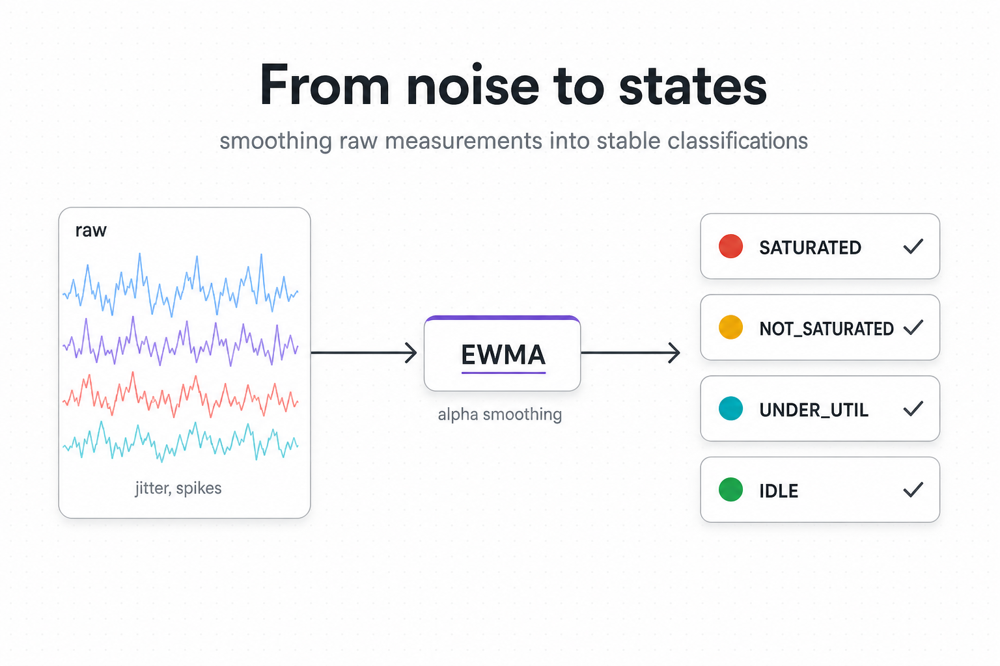

# 01 — Signals and classification



## The problem

Per-stage signals at the cycle scale are extremely noisy. One slow
task in a small worker pool drops the slot-empty ratio for a single
cycle and then recovers. A burst arrival inflates queue depth for
one cycle and then drains. Service-time samples vary per task by
tens of percent without anything actually changing.

If the controller reacts to every cycle's raw signal, every
decision is a coin flip:

```
   raw slot_empty_ratio per cycle
   1.0 ▲
       │   ●      ●        ●
   0.5 │ ●   ●  ●   ● ●  ●   ●     ← which cycle is "saturated"?
       │       ●           ●
   0.0 ●─────────────────────────▶ cycle
          1  2  3  4  5  6  7  8
```

Worse, scaling decisions are *categorical* (grow by N, shrink by
M, hold) but a noisy continuous signal cannot define a clean
boundary — a stage whose smoothed ratio sits at `0.32` one cycle
and `0.34` the next has *no* meaningful "I have been at 0.32 for
2 cycles" property. Streak counters become incoherent.

The classifier must also catch a stage that is **idle by slots but
backed up by queue** (stuck downstream of a bottleneck — slot
signal looks fine, but the queue is growing). A slot-only
classifier mistakes this for healthy idle time and refuses to scale
the actual bottleneck.

## What we do

Three layers sit between raw signals and a zone label:

1. **EWMA smoothing** on every continuous signal — slot empty
   ratio, queue backlog time, per-task service time. The smoothing
   factor `α` is a config knob (`alpha` close to 1 = react fast,
   close to 0 = smooth heavily).
2. **Slot-pin gate** — the smoothed slot ratio picks a *candidate*
   zone from four discrete labels.
3. **Pressure demotion (AND-criterion)** — the smoothed backlog-time
   pressure can demote the candidate when queue evidence disagrees
   with the slot evidence. `SATURATED` requires both slot pressure
   *and* queue pressure to commit; `OVER_PROVISIONED` requires both
   idle slots *and* a drained queue.

```
   smoothed signals                        committed zone
   ────────────────                        ──────────────
                                            NORMAL
   slots_empty_ratio_ewma ──┐               SATURATED
                            ├─▶ classify ─▶ SATURATED_CRITICAL
   pressure_ewma         ──┘                OVER_PROVISIONED
   (from backlog_time)
```

The four zones are:

| Zone | Slot signal | Queue signal | What it means |
|---|---|---|---|
| `NORMAL` | mid | mid | Stage is keeping up; nothing to do. |
| `SATURATED` | low (slots full) | high (queue growing) | Stage needs more capacity. |
| `SATURATED_CRITICAL` | very low (under activation threshold) | high or unknown | Urgent — bypasses some gates. |
| `OVER_PROVISIONED` | high (slots empty) | low (queue drained) | Stage has slack; safe to shrink. |

The **threshold itself scales with capacity**. A stage with one
slot per worker saturates at a different empty-ratio than a stage
with 32. The auto-derived formula `saturation_threshold = K /
sqrt(slots_per_worker)` lets the operator tune one cluster-wide
knob (`saturation_aggressiveness`, i.e. `K` = `β`) and have it Do
The Right Thing per stage. Halfin & Whitt's heavy-traffic regime
backs the `1 / sqrt(c)` scaling.

```
   ┌─────────────────────────────────────────────────────────┐
   │  threshold = K / sqrt(slots_per_worker)                 │
   │                                                         │
   │     slots=1   →  K / 1.0   = 0.30  (lots of headroom    │
   │                                     before "saturated") │
   │     slots=4   →  K / 2.0   = 0.15                       │
   │     slots=16  →  K / 4.0   = 0.075                      │
   │     slots=32  →  K / 5.66  = 0.053  (saturates faster)  │
   │                                                         │
   │  K = saturation_aggressiveness (default 0.30)           │
   └─────────────────────────────────────────────────────────┘
```

## Trade-offs

| Cost | Benefit |
|---|---|
| EWMA delays detection by ~`1/α` cycles. | Single noisy cycle is absorbed without a decision change. |
| Four-zone discretisation loses information at the boundary. | Streak counters become coherent; categorical decisions become unambiguous. |
| AND-criterion requires two signals to agree before scaling up. | Filters "looks busy but isn't bottleneck" false positives. |
| `K / sqrt(c)` adds one auto-derived field per stage at setup. | Single cluster-wide knob; no per-stage threshold retuning. |

## Theory we lean on

- **EWMA control charts** — standard low-pass filter for noisy
  control signals.
- **Little's Law** — `L = λ · W`. Backlog time
  `W = backlog / observed_throughput` is the throughput-invariant
  way to compare burst pressure across stages.
- **Halfin-Whitt regime** — heavy-traffic queueing theory; the
  `K / sqrt(c)` scaling is the regime's characteristic offset.

## Implementation pointer

Read in this order:

- `phases/intent/classifier.py::classify` — pure-function 4-state
  classifier; slot-pin gate plus pressure demotion.
- `phases/intent/pressure.py` — backlog-time computation and
  pressure EWMA.
- `state/stage_runtime.py::compute_slots_empty_ratio`,
  `update_ewma` — primitive signal aggregation.
- `thresholds/threshold_resolver.py::ThresholdResolver` —
  `K / sqrt(c)` resolution at cycle start.
- `specs.py::SaturationAwareStageConfig` — `α`, deadbands,
  pressure thresholds, `saturation_aggressiveness`.

