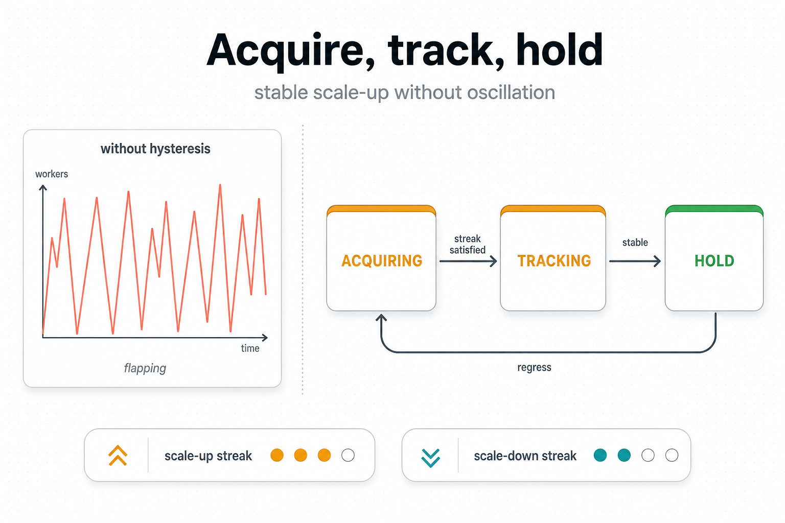

# 02 — Decisions and growth



## The problem

Even after the classifier produces a stable zone label, *acting*
on every cycle's label still misbehaves. Two ways:

1. **Flap.** The stage is barely above the saturation boundary;
   one cycle it labels `SATURATED`, next cycle `NORMAL`, next
   cycle `SATURATED`. Acting on each label produces grow / shrink
   / grow within a few seconds — the worker churns warm GPU state
   for no throughput gain.
2. **Overshoot at cold start.** The pipeline is just starting. The
   EWMA is not yet warm. The classifier still emits something —
   often `SATURATED` because slots are temporarily full while the
   queue drains the initial burst. Grow fires; minutes later the
   classifier corrects to `OVER_PROVISIONED`; shrink fires; cycle
   repeats.

```
    workers
       ▲
       │           ●●●
       │         ●     ●●●         ●●
       │       ●           ●●●   ●     ●
       │     ●                 ●●        ●
       │   ●
       └───────────────────────────────────▶ time
          ↑ flap zone: grow, shrink, grow ...
```

The asymmetry between scale-up and scale-down is the other half of
the problem. A wrong scale-up is cheap — the extra worker shrinks
back in a few cycles, no warm GPU state is lost. A wrong
scale-down kills warm state and costs a full
`worker_warmup_measurement_grace_s` window of throughput while the
replacement actor reloads its model.

## What we do

Three mechanisms gate every per-stage delta:

1. **Asymmetric streak counters** — a stage must stay in a zone
   for a configurable number of consecutive cycles before any
   action fires. The required streak length is **asymmetric**:
   short to grow (default `saturated_streak_min_cycles = 2`), long
   to shrink (`over_provisioned_streak_min_cycles = 10`).

2. **Stabilization-window consensus** — adjacent recommendation
   cycles must agree on direction. Even if the streak fires, the
   recommendation has to survive a small window of cycles checking
   that the *direction* is consistent.

3. **Growth-mode state machine** per stage. Three modes:

   - `ACQUIRING` — fresh stage, no shrink ever observed.
     Aggressive scale-up is allowed; the stage is still
     discovering its ceiling.
   - `TRACKING` — at least one shrink has been observed. The
     stage has hit a ceiling at least once; grow is fine but
     slightly more conservative.
   - `HOLD` — entered immediately after any shrink. Blocks
     `SATURATED` grow for `stabilization_window_cycles_down`
     cycles. `SATURATED_CRITICAL` is never blocked — a true
     overload must always be allowed to grow.

```
                 (no shrink yet)
                ┌──────────────────┐
       ┌────────│    ACQUIRING     │────────┐
       │        └──────────────────┘        │
       │                                    │
       │ first shrink                       │ HOLD timer
       ▼                                    │ expires
   ┌──────────────────┐               ┌──────────────────┐
   │     TRACKING     │  ─ shrink ─▶  │       HOLD       │
   └──────────────────┘               └──────────────────┘
                ▲                               │
                │                               │
                └───────────────────────────────┘
                       HOLD timer expires
                       (no further shrink)
```

The growth mode advances only on the **executed** delta (what
Grow or Shrink actually committed), not the recommended delta.
Hard worker caps, fraction clamps, and allocation failures can
shrink the planner's output below the recommendation; the FSM must
not observe deltas that never landed.

## Trade-offs

| Cost | Benefit |
|---|---|
| Reactions delayed by `streak × interval_s` seconds (short for up, long for down). | No flap — every committed change is backed by stable evidence. |
| Asymmetric streaks favour over-provisioning over scaling down. | Wrong scale-down costs a full warmup window; wrong scale-up does not. |
| One extra growth-mode field per stage in the ledger. | `HOLD` window prevents the immediate re-grow that would otherwise re-trigger the same shrink. |
| Stabilization window adds another cycle or two of latency. | Filters "single-cycle classifier disagreement" cases where streak passes but direction is unstable. |

## Theory we lean on

- **Hysteresis** — engineering control-loop term for the gap
  between enter and exit thresholds; standard mechanism to prevent
  control oscillation.
- **TCP slow-start** — `ACQUIRING` is the analogue:
  unconstrained growth until the first signal that we have hit a
  ceiling, then exponentially conservative.
- **HPA tolerance** (Kubernetes Horizontal Pod Autoscaler) — same
  intuition: a small dead-zone around the target prevents
  flap.

## Implementation pointer

- `phases/intent/decisions.py::update_streak`,
  `should_fire_action`, `compute_delta` — streak counter and
  recommended-delta logic.
- `phases/intent/stabilization.py::apply_stabilization_gate` —
  recommendation-window consensus.
- `phases/intent/growth_mode.py::compute_growth_mode_transition` —
  pure-function `ACQUIRING → TRACKING → HOLD` transition.
- `state/stage_runtime.py::GrowthMode`, `StageRuntimeState.growth`
  — per-stage growth FSM state.
- `state/recommendation_history.py::RecommendationHistory` —
  fixed-size ring buffer per stage for the stabilization gate.

