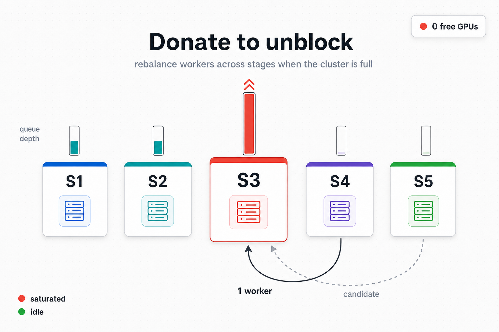

# 03 — Cross-stage rebalancing



## The problem

When the cluster is **fully booked** — every GPU and CPU
provisioned to some stage — a stage that newly saturates cannot
grow. The cluster planner has nothing to give it. Two production
failure modes follow:

1. **Floor stuck.** A stage has `min_workers >= 1` but zero live
   workers because the cluster is fully booked by earlier-started
   stages. The classifier has no slot signal to act on. The
   pipeline cannot make forward progress; eventually it raises a
   `RuntimeError` after the floor stuck grace expires.
2. **Saturation stuck.** A downstream stage classified `SATURATED`
   and needs `+N` workers, but an upstream stage holds the cluster.
   Throughput is bound on the wrong stage. Without rebalancing,
   the situation persists for the rest of the run.

```
   cluster: 8 GPUs total
   ─────────────────────
   S1 (upstream) ████████  ← holds 5 workers, NORMAL but earlier started
   S2 (mid)      ███       ← holds 3 workers, NORMAL
   S3 (down)     ░         ← wants +2 workers, SATURATED, queue growing

   no free placement slot. without rebalancing, S3 stays starved.
```

A naive "take a worker from anyone, give it to the saturated
stage" loop introduces three new failure modes:

- **Flicker** — two stages rotate the same worker every cycle.
- **Shape mismatch** — freeing a CPU-only worker cannot unblock
  a GPU receiver; freeing a single-GPU worker cannot satisfy a
  multi-GPU receiver.
- **Donor flip** — the freed donor becomes the next bottleneck;
  the pipeline trades one stuck stage for another.

## What we do

A single `DonorCoordinator` (template-method) runs the donor
transaction. Two policies plug into it — one for floor-mode
donations (urgent, youngest-first) and one for saturation-mode
donations (throughput-first, anti-flap). The transaction has four
gates:

1. **Eligibility funnel** — candidate donors must be
   `NORMAL` or `OVER_PROVISIONED`, must not have donated within
   `donor_cooldown_cycles`, must have workers older than
   `donor_warmup_grace_s`, and must not currently be the
   bottleneck stage.
2. **Bounded resource-fit search** — `ResourceFitPlanner` enumerates
   combinations of donor workers whose freed resources satisfy the
   receiver's shape. The search is bounded by
   `cross_stage_donor_max_plan_size` (workers per plan) and
   `cross_stage_donor_max_plan_combinations` (plans tried).
3. **Throughput-first economic gate** — proposed `D_k` after the
   transaction must improve `1 / max_k D_k`. If the donation
   would make the donor the new bottleneck (`D_donor_after >
   D_receiver_before`), the gate rejects.
4. **Probe + atomic commit** — the planner is asked whether the
   transaction is feasible *as a whole*. If yes, the donor's
   workers are removed and the receiver's workers are added in a
   single step. If anything fails between probe and commit (rare:
   planner snapshot diverged mid-cycle), the coordinator raises
   `SchedulerInvariantError`.

```
   receiver wants +N             cluster is full
            │                           │
            ▼                           ▼
   ┌──────────────────────────────────────────────┐
   │  policy.is_enabled(context)?                 │  ─ no ─▶  reject
   └──────────────────────────────────────────────┘
                          │ yes
                          ▼
   ┌──────────────────────────────────────────────┐
   │  list eligible donors                        │
   │   • NORMAL / OVER_PROVISIONED                │
   │   • outside donor_cooldown_cycles            │
   │   • workers older than warmup grace          │
   │   • not the bottleneck stage                 │
   └──────────────────────────────────────────────┘
                          │
                          ▼
   ┌──────────────────────────────────────────────┐
   │  ResourceFitPlanner: search combinations     │
   │   bounded by max_plan_size,                  │
   │              max_plan_combinations           │
   └──────────────────────────────────────────────┘
                          │
                          ▼
   ┌──────────────────────────────────────────────┐
   │  EconomicGate: does 1 / max_k D_k improve?   │
   └──────────────────────────────────────────────┘
                          │ yes
                          ▼
   ┌──────────────────────────────────────────────┐
   │  Transaction: probe → atomic remove + add    │
   │   probe fail   → policy-specific reject      │
   │   commit fail  → SchedulerInvariantError     │
   └──────────────────────────────────────────────┘
                          │ success
                          ▼
                  receiver +N, donor -N
                  ledger: last_donation_cycle += 1
```

The four anti-flap layers (cooldown, warmup grace, bottleneck
exclusion, economic gate) together guarantee that a donor cannot
flicker. The resource-fit search guarantees that the shape mismatch
case is detected before commit. The throughput-first gate
guarantees the donor flip case is rejected.

## Trade-offs

| Cost | Benefit |
|---|---|
| Bounded combinatorial search (small but non-trivial per cycle). | Real shape mismatches and donor flips are caught before commit. |
| Donor cooldown delays follow-up donations by several cycles. | No flicker; a donor cannot give-take-give-take. |
| Throughput-first gate can reject otherwise valid donations. | The cluster never trades one bottleneck for another. |
| Two donor policies (floor vs saturation) with different urgency. | Floor enforcement converges quickly; saturation rebalancing converges carefully. |

## Theory we lean on

- **Optimistic concurrency** — probe + atomic remove is the
  standard "check then commit, raise on race" pattern.
- **Two-phase commit** — the donor transaction has the same
  semantics: prepare phase (probe), commit phase (atomic remove
  + add), with rollback impossible (planner is single-threaded).

## Implementation pointer

- `donor/coordinator.py::DonorCoordinator` — template-method
  driver; the only object that holds the full donor flow.
- `donor/policy.py::FloorPolicy`, `SaturationPolicy` — the two
  per-mode strategy implementations.
- `donor/resource_fit.py::ResourceFitPlanner` — bounded
  combinatorial search.
- `donor/economic_gate.py::EconomicGate` — throughput-first
  rejection.
- `donor/transaction.py::DonorTransaction` — probe + atomic
  commit primitive.
- `donor/executor.py::DonorBackedAddExecutor` — phase glue;
  per-phase allocation gate + ledger update.
- `state/stage_runtime.py` — donor cooldown ledger
  (`last_donation_cycle`), worker ages.

