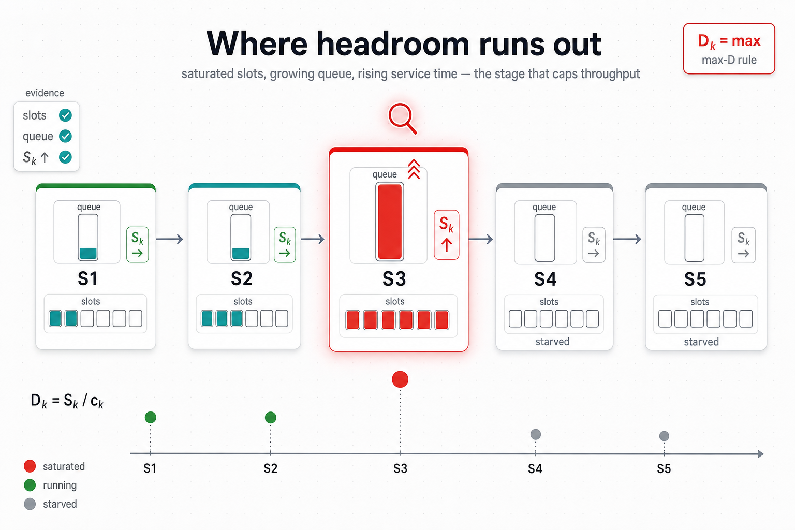

# 04 — Bottleneck awareness



## The problem

The per-stage classifier from [01 — Signals and classification](01-signals-and-classification.md)
is, by construction, **myopic**: each stage sees only its own slot
ratio and its own backlog time. It cannot answer the
pipeline-wide question:

> "Among all the stages that currently look busy, which one is the
> real throughput bottleneck?"

This matters because growing a non-bottleneck stage **cannot raise
pipeline throughput**. The new workers just push more inventory
onto the same downstream queue. The classic autoscaler mistake is
scaling the busy-looking stage instead of the slowest one.

```
   pipeline:   S1  ─▶  S2  ─▶  S3  ─▶  S4

   classifier says (per-stage):
     S1: SATURATED       ← upstream burst, slots full
     S2: SATURATED       ← keeping up but slots full
     S3: SATURATED       ← THE actual bottleneck
     S4: NORMAL          ← starved downstream of S3

   scale S1?  no, only fills S2's queue faster.
   scale S2?  no, only fills S3's queue faster.
   scale S3?  yes — raises 1 / max_k D_k.
```

The classifier alone cannot tell S1 / S2 / S3 apart. All three are
`SATURATED` by local evidence. Picking the wrong one wastes cluster
capacity for no throughput gain.

The opposite mistake matters too: shrinking the bottleneck stage
because its slot pressure briefly dropped (the burst momentarily
drained) is exactly the wrong thing — losing one bottleneck worker
costs a full warmup window of throughput, and during that window
the whole pipeline is slower.

## What we do

We compute a **second signal on top of the classifier**: the
Forced-Flow service demand of each stage.

```
   D_k = S_k / c_k

       where S_k = EWMA-smoothed per-task service time at stage k
             c_k = current capacity (workers × slots-per-worker,
                                     warmup-trusted)
```

`D_k` is the **wall time the stage spends per unit of pipeline
work**. Pipeline throughput is bounded by `1 / max_k D_k`. The
argmax stage is the structural bottleneck. The next bottleneck
candidate is the second-highest `D_k`.

We treat the bottleneck as **engaged** only when the spread between
the top stage and the rest is large enough — otherwise multi-target
DAG ordering takes over. Concretely we use a heterogeneity ratio
(`max / median` for ≥3 stages, `max / min` for 2 stages) and
require it to exceed `bottleneck_heterogeneity_threshold` before
the gate fires.

```
   stage     D_k          rank
   ────────────────────────────
   S1        0.8 s        2
   S2        0.4 s        3
   S3        2.5 s   ◀──  argmax (bottleneck candidate)
   S4        0.6 s        4 (rounding)

   max / median = 2.5 / 0.7 = 3.6  ≫  threshold (e.g. 1.5)
   ⇒ bottleneck engaged: S3
```

Once engaged, two decisions change:

1. **Grow priority** — the Grow phase walks positive-intent stages
   in `D_k`-descending order. The bottleneck stage is grown first
   when a scarce placement slot opens up.
2. **Shrink protection** — the Shrink phase skips the bottleneck
   stage as long as it has no ceiling overflow (i.e. the stage is
   not above its hard cap or its computed safe upper bound). A
   transient queue drain on the bottleneck does **not** shrink it.

`S_k` is smoothed (not `D_k`) because we want actor-count changes
to flow through `c_k` only — smoothing `D_k` would let a new worker
take a full EWMA window to register, which is the opposite of what
we want.

A **regime detector** runs once per cycle to decide whether the
cluster is in the Halfin-Whitt heavy-traffic regime, which lifts
the effective aggressiveness `K`. The regime is published as a
state and consumed by the threshold resolver — the classifier
implicitly becomes more aggressive when the cluster is packed.

## When this runs in the cycle

The bottleneck phase runs **every autoscale cycle, unconditionally**,
between Floor and Intent. Cluster state (full, partial, idle) is
irrelevant to the phase — it always fires.

The order matters: Intent, Grow, and Shrink all need a fresh
`D_k` snapshot to make their per-cycle decisions, so the snapshot
must be built before any of them runs.

```
   Pre-flight ─▶ Manual ─▶ Floor ─▶ Bottleneck ─▶ Intent ─▶ Grow ─▶ Shrink
                                        │            │       │       │
                                        │   reads ───┘       │       │
                                        │           reads ───┘       │
                                        │                  reads ────┘
                                        ▼
                          every cycle, always:
                            • update S_k EWMA per stage
                            • compute D_k = S_k / c_k per stage
                            • argmax → bottleneck candidate
                            • compute heterogeneity ratio
                            • publish BottleneckSnapshot onto the cycle
                            • emit Prometheus gauge + debounced INFO log
```

The bottleneck **identity** is computed unconditionally. What
varies cycle-to-cycle is whether the bottleneck-aware *decisions*
actually fire. Two gates apply:

| Gate | What it controls | When it fires |
|---|---|---|
| **Engagement gate** (`heterogeneity_ratio > bottleneck_heterogeneity_threshold`) | Whether the bottleneck signal biases Grow priority and Shrink protection at all. | Only when one stage clearly dominates the others. Multi-bottleneck workloads (similar `D_k` across stages) leave the gate disengaged. |
| **Consumer toggles** (`enable_bottleneck_priority_growth`, `enable_bottleneck_shrink_protection`) | Whether each individual consumer reads the bottleneck signal even when the engagement gate is open. | Default `True`. Operator escape hatch to fall back to DAG-depth ordering and unconditional shrink without rebuilding the cluster. |

What happens when the engagement gate is **off** (or a consumer
toggle is off):

- **Grow** walks positive-intent stages in **DAG-depth-descending**
  order (downstream-first); the bottleneck snapshot is computed
  but ignored.
- **Shrink** unconditionally honours the classifier's
  negative-intent recommendation; no stage gets protected.
- The Prometheus gauge `xenna_stage_bottleneck_score` still
  publishes `D_k` per stage, so the operator dashboard never
  goes dark — `D_k` ranks are visible whether the scheduler is
  acting on them or not.

What happens when the engagement gate is **on**:

- **Grow** walks positive-intent stages in **`D_k`-descending**
  order; the bottleneck stage is grown first when a scarce
  placement slot opens up.
- **Shrink** skips the bottleneck stage as long as it has no
  ceiling overflow (no hard-cap violation).

### Relation to the cluster-full donor path

The bottleneck phase does **not** know or care whether the
cluster is full — that question is handled separately by the
donor coordinator **inside Grow** (see
[03 — Cross-stage rebalancing](03-cross-stage-rebalancing.md)). Bottleneck
awareness and cross-stage donation are two different mechanisms
that interact through the same `D_k` snapshot:

```
                Bottleneck phase                       Donor coordinator
   ───────────────────────────────────       ────────────────────────────────
   • runs every cycle, every time            • runs inside Grow ONLY when a
   • computes D_k, picks bottleneck            stage cannot place a worker
   • decides grow priority order               (cluster is full)
   • decides shrink protection               • picks a donor stage to give
                                               up a worker to the receiver

                       │                                │
                       │ produces D_k snapshot          │ reads D_k snapshot
                       └───────────────▶────────────────┘
                              (BottleneckSnapshot on cycle)
                                          │
                                          ▼
                            EconomicGate inside the donor
                            uses D_k to reject donations
                            that would make the donor the
                            new bottleneck (donor-flip guard)
```

In short:

- **Bottleneck awareness** runs on *every* cycle, *regardless* of
  cluster state, and biases the **order** of grow / the
  **protection** of shrink.
- **Cross-stage donation** only runs *inside Grow* when a stage
  cannot place a worker because the cluster is full, and uses
  the bottleneck signal to **veto** donations that would create
  a new bottleneck.

If you are reading the code and looking for "where the bottleneck
matters", you will find it in three places: `phases/grow/...`
(priority order), `phases/shrink/...` (protection), and
`donor/economic_gate.py` (donor-flip rejection). All three read
the same `BottleneckSnapshot` published by `BottleneckPhase`.

## Trade-offs

| Cost | Benefit |
|---|---|
| Extra per-cycle compute: EWMA of `S_k`, divide by `c_k`, argmax. | Pipeline-wide bottleneck rank that the per-stage classifier cannot compute. |
| Bottleneck protection can hold a stage warm during prolonged idle. | Re-growing the bottleneck would cost a full warmup window. |
| Heterogeneity threshold introduces a small grey zone. | Multi-bottleneck workloads fall back to DAG-depth ordering cleanly. |
| One Prometheus gauge per stage (`xenna_stage_bottleneck_score`). | Operator and scheduler always agree on which stage is the bottleneck. |

## Theory we lean on

- **Forced Flow Law** (Operational Analysis):
  `D_k = S_k × V_k / c_k`. For a linear DAG, `V_k = 1` per stage,
  so `D_k = S_k / c_k`. Pipeline throughput is `1 / max_k D_k`.
- **Halfin-Whitt regime** (Halfin & Whitt, 1981) — heavy-traffic
  queueing regime where the optimal staffing offset scales with
  `sqrt(c)`. The regime detector decides when to apply the lift.

## Implementation pointer

- `phases/bottleneck/bottleneck_phase.py::BottleneckPhase` —
  one-phase orchestration.
- `phases/bottleneck/scoring.py::compute_d_k`,
  `compute_balance_score` — pure functions.
- `phases/bottleneck/identity.py::identify_bottleneck`,
  `maybe_log_bottleneck_engagement` — argmax + heterogeneity gate
  + debounced engagement log.
- `state/outputs.py::BottleneckSnapshot` — per-cycle output.
- `state/sk_ewma_store.py` — per-stage EWMA store with NaN-seed
  handling.
- `regime/regime_controller.py::RegimeController` — Halfin-Whitt
  detector and aggressiveness lift.
- `phases/grow/grow_phase.py`,
  `phases/shrink/shrink_phase.py` — consumers of the bottleneck
  snapshot.

