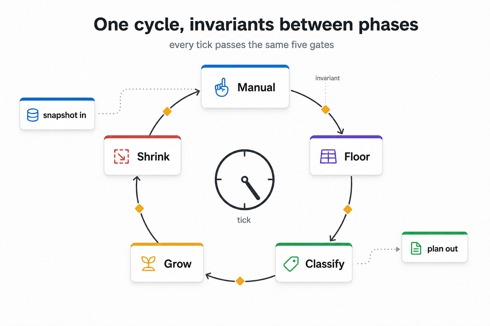

# 05 — Cycle and invariants



## The problem

A streaming autoscaler that emits "current best worker counts"
from a single monolithic decision step has three failure modes:

1. **Manual versus classifier collision.** An operator pins a
   stage via `requested_num_workers = 4`. The classifier wants
   `+2`. In a free-form decision step, whichever code path runs
   last wins. Outcome is order-dependent and non-deterministic.
2. **Floor versus cluster-capacity collision.** Floor enforcement
   (`min_workers`) collides with cluster capacity. A stage gets
   stuck at zero workers because the planner has nothing to give
   it. The classifier has no slot signal to react to — the bug is
   silent until the pipeline visibly deadlocks.
3. **Silent corruption.** A bug in a decision step — NaN ratio,
   negative count, off-by-one in floor math — emits a corrupted
   plan to the planner. The pipeline drifts before anyone notices.

```
   monolithic step       ───▶   Solution
     ↑   ↑   ↑   ↑   ↑
     |   |   |   |   |
   manual floor classifier grow shrink
        (precedence implicit; bugs invisible)
```

Implicit precedence and missing invariants turn every bug into a
silent production incident.

## What we do

One `autoscale()` call runs a **fixed five-phase pipeline** over a
per-cycle `AutoscaleCycle` object, with **invariants between every
phase**. Each phase is a stateless `@attrs.frozen` class. The
`CycleRunner` is the only object that holds all six phase services
simultaneously; each phase receives only its own narrow services.

```
              ┌──────────────────────────────┐
              │  Pre-flight (build cycle)    │
              └──────────────────────────────┘
                           │
                           ▼
              ┌──────────────────────────────┐
              │  Manual    (operator first)  │
              └──────────────────────────────┘
                           │  ◆ invariant: shape, monotonicity
                           ▼
              ┌──────────────────────────────┐
              │  Floor     (min_workers)     │
              └──────────────────────────────┘
                           │  ◆ invariant: floor satisfied
                           ▼
              ┌──────────────────────────────┐
              │  Bottleneck (D_k, identity)  │
              └──────────────────────────────┘
                           │  (no boundary invariant —
                           │   read-only signal)
                           ▼
              ┌──────────────────────────────┐
              │  Intent    (classify)        │
              └──────────────────────────────┘
                           │
                           ▼
              ┌──────────────────────────────┐
              │  Grow      (positive intent) │
              └──────────────────────────────┘
                           │  ◆ invariant: NaN-free, deltas valid
                           ▼
              ┌──────────────────────────────┐
              │  Shrink    (negative intent) │
              └──────────────────────────────┘
                           │  ◆ invariant: floor + monotonicity
                           ▼
              ┌──────────────────────────────┐
              │  Finalize  (stuck-plan, log) │
              └──────────────────────────────┘
                           ▼
                       Solution
```

The phase **order** matters as much as the phase content:

- **Manual runs first** because manual deletions free placement
  slots that Floor or Grow can reuse the same cycle. If Manual
  ran after the classifier, operator changes would converge in
  two cycles instead of one.
- **Floor runs before the classifier** because zero-worker stages
  have no slot signal to classify against. Floor must guarantee
  every non-finished stage has at least one worker the classifier
  can observe.
- **Bottleneck calculation sits between Floor and Intent** so the
  per-stage decision pipeline sees a fresh `D_k` mapping, and Grow
  / Shrink read the same snapshot.
- **Grow and Shrink are separated** so a single cycle never both
  grows and shrinks the same stage. Splitting positive and
  negative intent eliminates a whole class of within-cycle
  oscillation.

Invariants are pure-Python checks at every phase boundary. A
violation raises `SchedulerInvariantError`; the `Solution` is
**never** frozen with an invariant-violating state. Examples:

| Boundary | What the invariant checks |
|---|---|
| After Manual | No stage went below 0 or above `max_workers`; manual deltas align with `requested_num_workers`. |
| After Floor | Every non-finished stage has `current_workers ≥ floor`. |
| After Grow | `current_workers ≤ max_workers`; no NaN ratios; deltas are integers. |
| After Shrink | Floor still satisfied; no stage decreased below the previous cycle's bottleneck protection. |
| Solution shape | One `StageSolution` per stage; counts non-negative; deltas match per-phase ledger. |

```
   phase exits ─▶ ◆ invariant suite ─▶ next phase
                       │
                       └─ violation ─▶ SchedulerInvariantError
                                       (Solution never emitted)
```

## Trade-offs

| Cost | Benefit |
|---|---|
| O(stages) pure-Python checks per phase boundary. | Fail-loud refusal to emit a corrupt `Solution`. |
| Fixed phase order denies certain creative optimisations. | Manual / classifier / floor precedence is explicit. |
| Two phases (Grow, Shrink) where a single decision step could merge them. | No within-cycle oscillation; one stage cannot both grow and shrink. |
| Per-phase services value objects (one per phase, plus a runner). | Each phase has the smallest possible read surface; cross-phase coupling is visible at the runner. |

## Theory we lean on

- **Pipeline pattern** — fixed-order phase composition is the
  standard pattern for making implicit precedence explicit.
- **Design by Contract** — invariants between phases are the
  Eiffel-style "this state must hold at this boundary" contract,
  expressed as runtime checks.

## Implementation pointer

- `scheduler/saturation_aware.py::SaturationAwareScheduler.autoscale`
  — public entry; wraps the body in the loop watchdog.
- `lifecycle/preflight.py::PreflightBuilder` — builds the
  per-cycle `AutoscaleCycle`.
- `lifecycle/cycle_runner.py::CycleRunner.run` — fixed-order
  phase driver; the only object holding all phase services.
- `lifecycle/cycle_finalizer.py::CycleFinalizer` — stuck-plan
  invariant, post-cycle log, solution drain, worker-age persist.
- `state/autoscale_cycle.py::AutoscaleCycle` — per-cycle mutable
  cycle object.
- `phases/{manual,floor,bottleneck,intent,grow,shrink}/...` — the
  six phase classes; each `@attrs.frozen`, each stateless.
- `invariants/suite.py::PhaseInvariantSuite` — invariant
  registry; the runner calls it at every phase boundary.
- `scheduler/errors.py::SchedulerInvariantError` — the one
  exception raised on any invariant failure.

