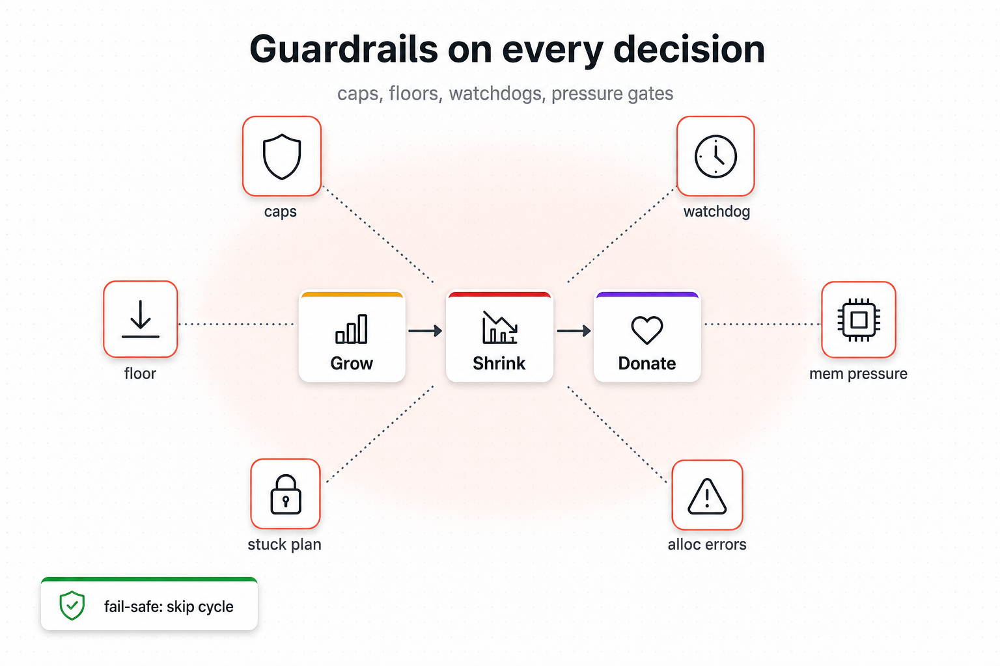

# 06 — Safeguards



## The problem

Per-phase logic can be perfect and the autoscaler can still
misbehave in production for reasons no single phase is qualified
to detect. Five failure surfaces that live **outside** the
classify-grow-shrink loop:

1. **Hard cap or floor violation.** A bug emits `worker_count = 1000`
   for a stage with `max_workers = 8`. Or a manual override
   accidentally drops a stage to zero workers, breaking the
   `min_workers >= 1` contract.
2. **Slow autoscale cycle.** Cycle wall time exceeds `interval_s`,
   so the next cycle starts before the previous one finishes.
   Decision latency silently doubles. No phase has the wall-clock
   to detect this.
3. **Cluster memory exhaustion.** Per-stage signals cannot see the
   sum of Ray object-store usage across stages. Two stages each at
   40% looks fine locally; together they OOM the cluster.
4. **Transient allocation errors.** The cluster planner returns
   `AllocationError` because of a momentary placement race; the
   phase that asked has no clean way to recover.
5. **Stuck plan.** A stage cannot place new workers — config typo,
   shape mismatch, cluster too small — and silently emits the same
   `+N` recommendation every cycle without progress. The pipeline
   degrades; no log line surfaces the problem.

```
   classify → grow → shrink → Solution → planner → cluster
                                                     │
                                              OOM    │   stuck    slow
                                              ▼      ▼   ▼        ▼
                                         (no log? no metric? no alert?)
```

If any of these go silent, the operator finds out hours later from
throughput dashboards. The scheduler must surface them as they
happen.

## What we do

Six safeguards wrap the decision pipeline. Each one is a small
value object that lives outside any single phase.

```
                ┌───────────────────────────────────┐
                │            classify               │
                │           grow / shrink           │
                │              donate               │
                └───────────────────────────────────┘
                  ▲    ▲    ▲    ▲    ▲    ▲
                  │    │    │    │    │    │
                caps  loop  mem  alloc stuck floor
                      ●     ●    ●     ●
                  ●                          ●

   ●  hard caps  — every Solution clamped to [floor, ceiling]
   ●  loop watchdog — cycle wall time histogrammed; WARN on slow
   ●  memory pressure — Phase Grow paused over critical threshold
   ●  alloc tolerance — AllocationError absorbed per-phase, attributed
   ●  stuck plan — per-stage WARN→INFO latch; metric and structured log
   ●  floor — every non-finished stage ≥ min_workers; donor on fail
```

### Hard caps and floors

Every emitted `StageSolution` is clamped to
`[max(min_workers, min_workers_per_node), max_workers]` after the
phases run. Bugs that would emit `worker_count = 1000` clamp to
`max_workers` instead of mutating the cluster. The floor side is
enforced earlier (in the Floor phase, with donor fallback) so the
classifier can rely on a non-zero worker count for every stage.

### Loop watchdog

`loop_watchdog` is a context manager that histograms cycle wall
time. The `autoscale()` body runs inside the manager; on exit, the
duration is recorded in
`xenna_scheduler_cycle_duration_seconds`. If wall time crosses
`cycle_time_warn_threshold × interval_s` (default 0.5 × 5 s =
2.5 s), a WARN log fires identifying the slow cycle.

### Memory-pressure gate

`MemoryPressureMonitor` polls cluster-wide Ray object-store
usage every `memory_pressure_polling_interval_s`. When the cluster
fraction exceeds `memory_pressure_critical_threshold` (default
0.9), the Grow phase is **paused** for the cycle — Floor and
Shrink continue to run. The gate releases as soon as the fraction
drops below the threshold.

### Allocation-error tolerance

A planner placement call can raise `AllocationError` because of a
transient race (worker died mid-cycle, planner snapshot diverged).
Each phase that places workers (Manual, Floor, Grow) owns its own
`AllocationFailureGate`. The gate absorbs one or two transient
errors per cycle, attributes them to the phase that asked, and
re-raises if errors persist beyond the tolerance budget.

### Stuck-plan detector

A stage that emits the same positive recommendation every cycle
without progress increments a per-stage stuck counter. After
`stuck_plan_warn_cycles` cycles in the same state, the detector
promotes to a single WARN log line per stage and exposes
`xenna_stage_stuck_plan_active` (gauge: 1 if active, 0 otherwise)
plus `xenna_stage_stuck_plan_cycles_total` (counter). The latch
re-arms on any forward progress; we never spam the log.

### Floor stuck handling

If Floor cannot satisfy `min_workers` for a stage even with the
donor coordinator, the floor-stuck counter increments. After
`floor_stuck_grace_cycles` cycles in that state, `RuntimeError`
is raised — the operator sees the deadlock immediately instead
of waiting for throughput to degrade.

## Trade-offs

| Cost | Benefit |
|---|---|
| Six safeguards = six places to update if a config field is renamed. | Each safeguard is small, single-responsibility, and independently testable. |
| Loop watchdog histogram adds one Prometheus series per pipeline. | Slow cycles are visible in Grafana before the operator notices throughput loss. |
| Memory-pressure gate can pause Grow even when individual stages are healthy. | The cluster never OOMs the Ray object store. |
| Allocation tolerance can hide a real placement failure for one or two cycles. | Transient races are not promoted to user-visible exceptions. |
| Stuck-plan detector requires per-stage state across cycles. | Real stuck stages surface as a metric and one structured log line. |

## Theory we lean on

- **Defence in depth** — multiple independent safety layers; a
  single bug never produces a silent failure.
- **Bulkhead pattern** — each safeguard owns its own state and
  fails independently; one safeguard failing does not corrupt the
  others.

## Implementation pointer

- `lifecycle/loop_watchdog.py::loop_watchdog` — cycle-wall-time
  context manager.
- `cluster/memory_pressure.py::MemoryPressureMonitor` — periodic
  poll + critical-threshold gate.
- `state/allocation_failure_gate.py::AllocationFailureGate` —
  per-phase transient-failure absorber.
- `lifecycle/post_cycle.py::StuckPlanInvariant`,
  `state/stuck_plan_ledger.py::StuckPlanLedger` — per-stage
  WARN→INFO latch.
- `phases/floor/floor_phase.py::FloorPhase` — floor enforcement +
  donor fallback + floor-stuck grace.
- `state/ledgers.py::SchedulerLedgers.floor_stuck_counters` —
  cross-cycle floor-stuck state.
- `specs.py::SaturationAwareConfig` — threshold fields
  (`cycle_time_warn_threshold`,
  `memory_pressure_critical_threshold`, `floor_stuck_grace_cycles`,
  `stuck_plan_warn_cycles`).

