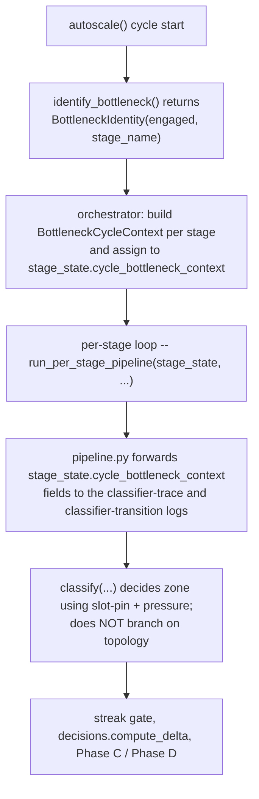

# 27 — Topology-aware classifier

## TL;DR

A drained input queue with idle slots maps uniformly to
`OVER_PROVISIONED`, regardless of whether the idleness is genuine
over-provisioning or backpressure from a downstream bottleneck.
Topology context (whether this stage is upstream or downstream of
an engaged bottleneck) is surfaced on the per-cycle log lines as
`bottleneck_engaged=` and `upstream_of_bottleneck=` fields. There
is no separate state for "starved by upstream bottleneck" — the
scheduler action is the same in every queue=0+idle case (eligible
for shrink and for cross-stage donation), so a separate label
would be a duplicate enum value.

## Problem

A pipeline like `A -> B -> Bottleneck -> D` produces idle stages on
both sides of `Bottleneck`. `A` and `B` accept no new tasks because
their downstream output queue stalls; `D` consumes nothing because
`Bottleneck` is producing slowly. All four stages observe
`input_queue_depth == 0` with idle slots in many cycles, but only
the bottleneck itself is the actionable target.

A classifier that maps `queue == 0 + idle slots` to a "no-action"
state by default would make every upstream stage hold its workers
even when they could donate to the bottleneck. A production
captioning run reproduced exactly this failure: upstream stages
held idle fractional-GPU workers while the downstream
`VllmAsyncCaptionStage` stalled at "cluster placement exhausted"
because no GPU was free for it to scale.

## Decision

Map `queue == 0 + idle slots` to `OVER_PROVISIONED` like every
other idle case, subject to the same pressure-demotion gate. The
state machine is intentionally minimal: only four zones, none of
which discriminate by queue-depth alone.

```
                                    Bottleneck
                                       v
   +---+
   | A   | -> | B   | -> | C   | -> | D   |
   |idle |    |idle |    |SAT  |    |idle |
   +---+

   classifier verdict:                C is SATURATED;
                                      A, B, D are all
                                      OVER_PROVISIONED.

   Phase D shrink + donor pass: A, B, D become donors for C
   once over_provisioned_streak_min_cycles is reached.

   Per-cycle log line for A:
     classifier transition: stage='A' NORMAL -> OVER_PROVISIONED
       (pressure_ewma=0.05, slots_empty_ratio_ewma=0.95, queue=0,
       streak=1, bottleneck_engaged=True,
       upstream_of_bottleneck=True, delta=0)
```

The topology context is published once per cycle by
`SaturationAwareScheduler._refresh_cycle_bottleneck_context`
(see
[`saturation_aware.py`](../../../cosmos_xenna/pipelines/private/scheduling_py/saturation_aware.py)).
Every `_StageRuntimeState` carries a fresh
[`BottleneckCycleContext`](../../../cosmos_xenna/pipelines/private/scheduling_py/bottleneck.py)
each cycle; the per-stage decision pipeline reads it for the
diagnostic log fields and does NOT branch on it for the zone
verdict.

## Why STARVED was removed, not repurposed

A previous design carried a `STARVED` enum value for the
"queue=0 + idle slots, upstream is the bottleneck" case. Three
properties of the topology-aware design make `STARVED` redundant:

1. **Same scheduler action.** Whether a stage is over-provisioned
   for the source rate, over-provisioned because backpressured by
   a downstream bottleneck, or starved by an upstream bottleneck,
   the right local action is identical: become a shrink candidate
   and a cross-stage donor candidate. The streak gate
   (`over_provisioned_streak_min_cycles`, default 30 cycles ≈ 5
   min) prevents premature shrink in any of these cases.
2. **Topology context is richer in the log.** The per-cycle log
   already names the bottleneck stage and the upstream/downstream
   relation via `bottleneck=` and `upstream=` fields. A single-
   word `STARVED` label would be strictly less informative than
   the structured log line operators already read.
3. **Industry convergence.** Apache Flink (FLIP-271 autoscaler),
   Cloud Dataflow (`backlog_time` signal), Heron-Dhalion
   (bottleneck diagnoser), and Ray Data (continuous utilisation
   plus per-op resource budgets) all resolve the same case
   without a discrete `STARVED` state. Two out of three use
   topology context to drive the decision; the fourth avoids
   the question entirely with continuous budgets. None of them
   carry a `queue == 0 -> no-action` short-circuit.

`StageState.STARVED` and the `starved_streak_min_cycles` knob
were removed in the same commit per
[`.cursor/rules/no-legacy.mdc`](../../../.cursor/rules/no-legacy.mdc).
A regression sentry test
(`test_stage_state_enum_does_not_contain_starved` in
[`test_saturation_aware_classifier.py`](../../../cosmos_xenna/pipelines/private/test_saturation_aware_classifier.py))
flags any future re-introduction.

## Industry alignment

| System                              | How it handles the same case                                                                                                          |
|---|---|
| Apache Flink (Kubernetes Operator autoscaler, FLIP-271) | Propagates `TARGET_DATA_RATE` upstream from the bottleneck; upstream operators are scaled to the downstream-capped target.            |
| Cloud Dataflow (Streaming Engine)   | Uses `backlog_time = backlog_bytes / throughput` as the primary autoscaling signal; idle queue is interpreted in topology context.    |
| Heron-Dhalion                       | Topology-aware diagnoser identifies the bottleneck via backpressure + GrowingWaitQueue detectors; `ScaleUpResolver` targets it.       |
| Ray Data (master)                   | Continuous actor-pool utilisation + per-operator resource budgets + downstream-capacity backpressure. No discrete state classifier.   |

The Cosmos-Xenna saturation-aware classifier is closest to
Cloud Dataflow + Flink: it uses backlog-time pressure as the
primary discriminator and surfaces the topology relation as
operator-readable diagnostic context.

## Wiring



The orchestrator step (build context) runs **before** the per-
stage decision pipeline so log fields are aligned with the
current cycle's bottleneck identity, not the prior cycle's.

## Removed knobs

| Removed                              | Replacement                                                                                                                  |
|---|---|
| `enable_backlog_time_classifier`     | Permanently on. The slot-only escape hatch is gone — the pressure-demotion gate is the only classifier path.                |
| `starved_streak_min_cycles`          | Removed. `STARVED` no longer exists; the upstream-bottleneck warning the knob gated has been superseded by the bottleneck-engagement INFO log in [`bottleneck.py`](../../../cosmos_xenna/pipelines/private/scheduling_py/bottleneck.py). |

## See also

- [05 — State classifier](05-state-classifier.md) — the four-zone
  state machine.
- [06 — Backlog-time signal](06-backlog-time-signal.md) — the
  pressure-demotion gate the topology context interacts with.
- [25 — Bottleneck decision integration](25-bottleneck-decision-integration.md)
  — how Phase C and Phase D consume the bottleneck identity for
  growth-priority and shrink-protection decisions.
