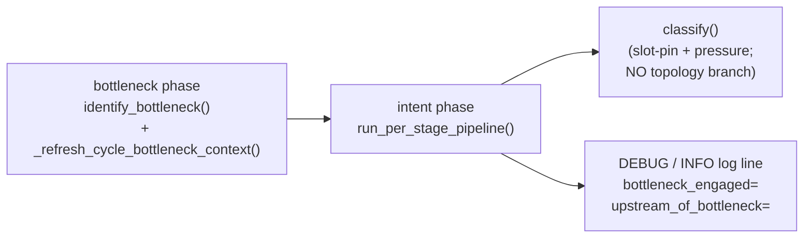

# 27 — Topology-aware classifier

## TL;DR

A drained input queue with idle slots maps uniformly to
`OVER_PROVISIONED`, subject to the pressure-demotion gate that
demotes to `NORMAL` when the queue is stuck downstream. Every
queue=0+idle case produces the same scheduler action (eligible
for shrink and for cross-stage donation), so the state machine
keeps a single label for it. The topology relation — whether
this stage sits upstream or downstream of the engaged
bottleneck — is published once per cycle on every
`_StageRuntimeState` and surfaces in the per-cycle log lines as
`bottleneck_engaged=` and `upstream_of_bottleneck=` fields,
where it is more useful than as a separate state name.

```
   ┌──────────────────────────────────────────────────────┐
   │  queue == 0 + idle slots  ──▶  OVER_PROVISIONED      │
   │                                (subject to pressure  │
   │                                 demotion to NORMAL)  │
   └──────────────────────────────────────────────────────┘

   topology context ──▶ log fields (bottleneck_engaged=,
                        upstream_of_bottleneck=)
                        — not a state-machine branch
```

## Problem

A linear chain `A -> B -> Bottleneck -> D` produces idle stages
on both sides of the bottleneck. `A` and `B` accept no new tasks
because their downstream output queue stalls; `D` consumes
nothing because the bottleneck is producing slowly. All three
stages observe `input_queue_depth == 0` with idle slots in many
cycles, even though only the bottleneck itself is the actionable
target.

A scheduler that maps "drained queue + idle slots" to a no-action
state by default makes every upstream stage hold its workers
indefinitely, even when those workers could donate to the
bottleneck. That is the failure shape the topology-aware
classifier is designed to avoid: in a fractional-GPU pipeline,
upstream stages can hold the GPU capacity the bottleneck needs
to scale, leaving the cluster stuck at "placement exhausted"
while the actionable target has no headroom.

```
                                Bottleneck
                                    ▼
   ┌──────┐    ┌──────┐    ┌──────┐    ┌──────┐
   │  A   │ ─▶ │  B   │ ─▶ │  C   │ ─▶ │  D   │
   │ idle │    │ idle │    │ SAT  │    │ idle │
   │ q=0  │    │ q=0  │    │ q=K  │    │ q=0  │
   └──────┘    └──────┘    └──────┘    └──────┘

   classifier verdict :   OP       OP      SATURATED   OP
                         (over-   (over-              (over-
                          prov.)   prov.)              prov.)
   action  (after        donate   donate   want grow  donate
   streak threshold)    ─────────────────▶ C grows; cluster
                                            unblocks.

   OP = OVER_PROVISIONED ; q = input_queue_depth
```

## Decision

`queue == 0 + idle slots` maps to `OVER_PROVISIONED` like every
other idle case, subject to the pressure-demotion gate. The
state machine is intentionally minimal: only four zones, none of
which discriminate by queue-depth alone. The pressure-demotion
gate handles the "downstream stuck" case by demoting to `NORMAL`
when the smoothed pressure scalar exceeds
`pressure_normal_threshold`, so a stage already paying the cost
of a downstream bottleneck does not also lose workers and worsen
the stall.

```
   slots-empty ratio ─▶ 0.0 ────── 0.05 ────── 0.15 ────── 0.50 ─────▶ 1.0
                       activation_thr      saturation_thr   over_prov_thr
                            │                  │               │
   ┌────────────────────────┼──────────────────┼───────────────┼─────────────┐
   │   SATURATED_CRITICAL   │     SATURATED    │    NORMAL     │  OVER_PROV  │
   └────────────────────────┴──────────────────┴───────────────┴─────────────┘

   pressure-demotion gate (after the slot-pin lands a candidate zone):
       SATURATED_CRITICAL  ─── pressure ≤ critical_thr  ─▶  fall through
       SATURATED           ─── pressure ≤ saturation_thr ─▶ NORMAL
       OVER_PROVISIONED    ─── pressure >  normal_thr    ─▶ NORMAL
                                                            (downstream stuck —
                                                             do not shrink)
```

The orchestrator publishes per-cycle topology context onto every
stage's runtime state right after `identify_bottleneck()` returns;
the per-stage decision pipeline reads that context for the
diagnostic log fields and never branches on it for the zone
verdict. This keeps `classify()` a pure function of slot-pin and
pressure, with no cluster-wide state coupling.

## One label, not many

Every "drained queue + idle slots" case reduces to the same
scheduler action — wait `over_provisioned_streak_min_cycles`,
then become a shrink and cross-stage donor candidate — so a
single label `OVER_PROVISIONED` carries it. Whether the
idleness is genuine over-provisioning, backpressure-induced
upstream of an engaged bottleneck, or the consequence of
upstream starvation, the local action is the same. The
information operators actually need when triaging a stalled
pipeline (which stage is the bottleneck, which side of the
bottleneck I am on) lives in the structured log line, where
it is strictly richer than a single-word state name.

```
   ┌─────────────────────────────────────────────────────────────────────┐
   │                                  OVER_PROVISIONED                   │
   │ scheduler delta                  0  (until streak gate fires)       │
   │ donor eligibility                yes (over_provisioned_streak_      │
   │                                       min_cycles, default 30)       │
   │ shrink eligibility               yes (same streak gate)             │
   │ topology context (in log line)   bottleneck_engaged=,               │
   │                                  upstream_of_bottleneck=            │
   └─────────────────────────────────────────────────────────────────────┘
```

A regression sentry test (`test_stage_state_enum_does_not_contain_starved`
in
[`test_saturation_aware_classifier.py`](../../../cosmos_xenna/pipelines/private/test_saturation_aware_classifier.py))
guards the four-zone shape of `StageState`.

## Per-cycle wiring

Topology context is computed once per cycle, immediately after
the bottleneck is identified and before the per-stage intent
loop reads it. Putting the bottleneck phase ahead of the intent
phase guarantees that diagnostic log fields are aligned with the
current cycle's bottleneck identity, not the prior cycle's. The
`_refresh_cycle_bottleneck_context` helper walks every stage's
`_StageRuntimeState` and overwrites its `cycle_bottleneck_context`
with a fresh `BottleneckCycleContext`. Stale bottleneck identities
(a stage name no longer present in `_stage_names`, e.g. after a
stage list change) fall through a defensive branch that publishes
the no-bottleneck default to every stage rather than risk a
misaligned context.

```
   autoscale() cycle ─────────────────────────────────────────────▶
   ┌──────────────┐   ┌──────────────────┐   ┌──────────────────┐   ┌──────┐   ┌──────┐
   │ phase_a      │ ─▶│ phase_b          │ ─▶│ bottleneck       │ ─▶│ ...  │ ─▶│ phase│
   │ (delete +    │   │ (worker floor)   │   │ identify +       │   │      │   │ _c / │
   │  early grow) │   │                  │   │ refresh per-stage│   │      │   │ _d   │
   │              │   │                  │   │ context          │   │      │   │      │
   └──────────────┘   └──────────────────┘   └──────────────────┘   └──────┘   └──────┘
                                                      │                ▲
                                                      ▼                │
                                              _refresh_cycle_           │
                                              bottleneck_context()     │
                                                      │                │
                                                      ▼                │
                                              _StageRuntimeState        │
                                              .cycle_bottleneck_        │
                                              context (per stage)       │
                                                      │                │
                                                      ▼                │
                                              ┌──────────────────┐     │
                                              │ intent (per-stage│ ────┘
                                              │ run_per_stage_   │
                                              │ pipeline) reads  │
                                              │ context for log  │
                                              │ fields ONLY      │
                                              └──────────────────┘
```



## See also

- [05 — State classifier](05-state-classifier.md) — the four-zone state machine.
- [06 — Backlog-time signal](06-backlog-time-signal.md) — the pressure-demotion gate.
- [25 — Bottleneck decision integration](25-bottleneck-decision-integration.md) — how Phase C / Phase D consume the bottleneck identity.
