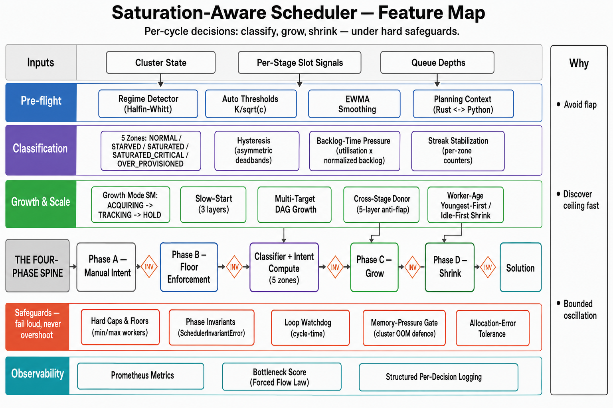

# Saturation-Aware Scheduler — Feature Reference

The saturation-aware scheduler is the streaming-mode autoscaler
that decides how many workers each pipeline stage gets each cycle.
It reads slot-occupancy, queue-depth, and backlog-time pressure
signals, classifies each stage into one of four operational zones
(`NORMAL`, `SATURATED`, `SATURATED_CRITICAL`, `OVER_PROVISIONED`),
and grows or shrinks worker counts within a stack of stability and
safety guards.

This folder holds one document per design decision. Each doc is a
short rationale (problem → decision → diagram → knobs), not a
reference manual — the source-file docstrings carry the contracts.
Every doc is written from the shipped code in
[`cosmos-xenna/cosmos_xenna/pipelines/private/scheduling_py/`](../../../cosmos_xenna/pipelines/private/scheduling_py/).

## At a glance

The diagram above is a one-page summary of every feature documented
in this folder, grouped by category and anchored to the four-phase
cycle (`A → B → C → D`) the scheduler runs every tick:

- **Pre-flight (blue)** — regime detector, auto-derived thresholds,
  EWMA smoothing, and the Rust ⇄ Python planning context bridge.
- **Classification (purple)** — the four operational zones, asymmetric
  hysteresis, the backlog-time pressure signal, and the streak
  counters that gate every decision.
- **Growth & Scale (green)** — the `ACQUIRING → TRACKING → HOLD`
  growth-mode state machine, three-layer slow-start, multi-target
  DAG growth, the five-layer anti-flap cross-stage donor, and
  youngest-first / idle-first victim selection.
- **Safeguards (red)** — hard caps and floors, phase invariants,
  loop watchdog, cluster-wide memory-pressure gate, and
  allocation-error tolerance. These run *around* every phase and
  are why a corrupted decision never reaches workers.
- **Observability (teal)** — Prometheus metrics, the Forced-Flow-Law
  bottleneck score (now also a scheduler input that prioritises
  Phase C growth and protects the bottleneck from Phase D shrink),
  and per-decision structured logging.

Open the matching doc in the index below to see the rationale,
trade-offs, and knobs for any box on the diagram.

## What this folder is and is not

- **Is**: decision-rationale + diagrams for the saturation-aware
  autoscaler, written so an engineer or operator can absorb each
  feature in roughly two minutes.
- **Is not**: a tutorial, a reference manual, a research paper, or
  a vendored copy of any planning document. Open the matching
  source file when you need exact field types or default values.

## Reading order for new readers

If you have never touched this scheduler before, read in this
order. Each doc is independent after the overview, so you can
stop after step 4 if all you need is the cycle structure.

1. [00 — Per-cycle overview](00-overview.md) — the full
   `autoscale()` cycle on one page.
2. [01 — Scheduler selection](01-scheduler-selection.md) — how
   a pipeline opts into this scheduler.
3. [02 — Configuration model](02-configuration-model.md) — the
   two config classes and the three-tier resolver.
4. [04 — Per-cycle pipeline](04-per-cycle-pipeline.md) — the
   four phases (A → B → C → D) inside one cycle.

After the overview tier, dive into whichever decision is
relevant to the question you have.

## Operator tuning quick-reference

If you are not investigating a design decision but just want to
adjust a knob in production, jump to:

- [Operator Tuning Guide](tuning.md) — primary knobs, a
  symptom-to-knob index, and workload-class example configs.

## Full index

### Architecture and configuration

| Doc | Topic |
|---|---|
| [01-scheduler-selection.md](01-scheduler-selection.md) | Feature flag + dispatcher (`SchedulerKind`) |
| [02-configuration-model.md](02-configuration-model.md) | `SaturationAwareConfig` + `SaturationAwareStageConfig` + 3-tier resolver |
| [03-planning-context.md](03-planning-context.md) | `AutoscalePlanContext` Rust ⇄ Python planner bridge |
| [04-per-cycle-pipeline.md](04-per-cycle-pipeline.md) | Phase A / B / C / D orchestration inside `autoscale()` |

### Classification

| Doc | Topic |
|---|---|
| [05-state-classifier.md](05-state-classifier.md) | Four-zone classifier with hysteresis |
| [06-backlog-time-signal.md](06-backlog-time-signal.md) | Compound AND-criterion (utilisation + queue-time) |
| [07-streak-stabilization.md](07-streak-stabilization.md) | EWMA smoothing + asymmetric streak counters |
| [08-auto-derived-thresholds.md](08-auto-derived-thresholds.md) | `K / sqrt(c)` aggressiveness formula |
| [09-regime-aware-aggressiveness.md](09-regime-aware-aggressiveness.md) | Halfin-Whitt regime detector + lift |

### Growth and scale

| Doc | Topic |
|---|---|
| [10-slow-start-mechanisms.md](10-slow-start-mechanisms.md) | Three layers that suppress cold-start overshoot |
| [11-growth-mode-state-machine.md](11-growth-mode-state-machine.md) | `ACQUIRING` → `TRACKING` → `HOLD` |
| [12-multi-target-dag-growth.md](12-multi-target-dag-growth.md) | Why all saturated stages grow per cycle |
| [13-cross-stage-donor.md](13-cross-stage-donor.md) | Five-layer anti-flap donor protocol |
| [14-worker-age-tracking.md](14-worker-age-tracking.md) | Youngest-first donor selection substrate |
| [15-idle-first-scale-down.md](15-idle-first-scale-down.md) | Phase D consolidation-aware victim ordering |

### Safeguards

| Doc | Topic |
|---|---|
| [16-hard-caps-and-floors.md](16-hard-caps-and-floors.md) | Per-stage / per-node `min_workers`, `max_workers` |
| [17-config-validation.md](17-config-validation.md) | Field + cross-field validators |
| [18-loop-watchdog.md](18-loop-watchdog.md) | Cycle-time monitoring |
| [19-phase-invariants.md](19-phase-invariants.md) | `SchedulerInvariantError` between phases |
| [20-memory-pressure-gate.md](20-memory-pressure-gate.md) | Cluster-wide OOM defence |
| [21-allocation-error-tolerance.md](21-allocation-error-tolerance.md) | Transient-failure recovery |

### Observability

| Doc | Topic |
|---|---|
| [22-prometheus-metrics.md](22-prometheus-metrics.md) | The full metrics catalogue |
| [23-bottleneck-score-metric.md](23-bottleneck-score-metric.md) | Forced-Flow-Law bottleneck gauge |
| [24-structured-logging.md](24-structured-logging.md) | Per-decision INFO logging contract |
| [25-bottleneck-decision-integration.md](25-bottleneck-decision-integration.md) | EWMA-smoothed `D_k` driving Phase C grow priority and Phase D shrink protection |
| [26-stuck-plan-detector.md](26-stuck-plan-detector.md) | Per-stage WARN-to-INFO latch + Prometheus instrumentation for `_stuck_plan_counters` |

## Conventions used in these docs

- **Diagrams** use Unicode box-drawing characters
  (`┌ ┐ └ ┘ │ ─ ├ ┤ ┬ ┴ ┼ → ⇒ ● ○`). They are the primary
  teaching aid; prose around a diagram is captions.
- **Source links** point at files in
  [`cosmos-xenna/cosmos_xenna/pipelines/private/scheduling_py/`](../../../cosmos_xenna/pipelines/private/scheduling_py/).
  Open the source for exact types and defaults.
- **Configuration field names** are written verbatim in
  back-ticks and resolve to fields on
  `SaturationAwareConfig` or `SaturationAwareStageConfig` in
  [`cosmos-xenna/cosmos_xenna/pipelines/private/specs.py`](../../../cosmos_xenna/pipelines/private/specs.py).
- **External concepts** (TCP slow-start, Halfin-Whitt regime,
  Forced Flow Law, K8s topology spread, Cloud Dataflow
  Streaming Engine backlog signal, HPA tolerance) are cited
  by name; follow the public references at the end of each
  doc when you want the academic primary source.
