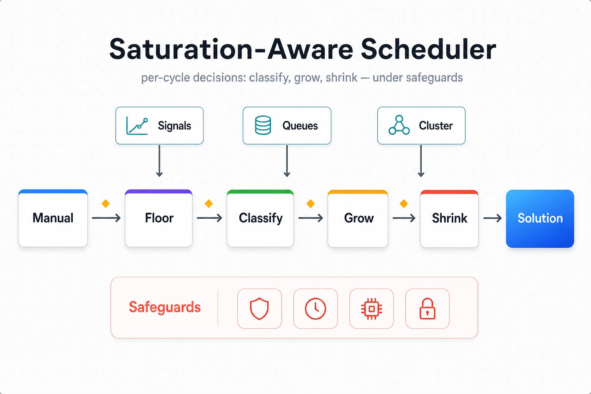

# Saturation-Aware Scheduler



The saturation-aware scheduler decides, every few seconds, how many
workers each pipeline stage should run. It does that by reading
**saturation evidence** — how full the slots are, how deep the
queue is, how long the per-task service time has become — rather
than by guessing from placement or utilisation alone.

This page is the entry point for an engineer brand-new to the
scheduler. Read it top-to-bottom in fifteen minutes and you will
know what the scheduler does, why it is shaped the way it is, and
where to dive deeper. The six numbered **concept notes** in this
folder go one layer deeper into each topic; **`tuning.md`** is for
operators.

---

## 1. Two-minute pitch

A Cosmos-Xenna pipeline is a streaming DAG of stages. Each stage
owns a pool of workers; the cluster has a finite resource budget.
The scheduler runs on a fixed interval and emits, for every stage,
a target worker count.

```
                       saturation-aware scheduler

   ┌────────────┐    every tick    ┌────────────┐
   │  signals   │  ─────────────▶  │  decision  │
   │            │                  │            │
   │  slots     │                  │  +N here   │
   │  queue     │                  │   0 there  │
   │  service   │                  │  ─M there  │
   └────────────┘                  └────────────┘
         ▲                                │
         │                                ▼
   ┌──────────────────────────────────────────────┐
   │  cluster of workers (Ray actors on GPUs)     │
   └──────────────────────────────────────────────┘
```

Inside the box, the work is split into five logical steps —
**Manual, Floor, Classify, Grow, Shrink** — wrapped by
**Safeguards** (caps, watchdogs, pressure gates) and validated by
**invariants** between every step. The legacy fragmentation-based
scheduler co-exists behind the `SchedulerKind` switch; see
`SaturationAwareConfig` in `specs.py`.

---

## 2. The problem this scheduler solves

Three facts drive every design decision below.

1. **Pipeline throughput is capped by the slowest stage.**
   Throughput is bounded by `1 / max_k D_k`, where the
   service demand of stage `k` is `D_k = S_k / c_k`
   (per-task service time `S_k` divided by stage capacity `c_k`).
   Over-provisioning any non-bottleneck stage cannot raise
   throughput — the new workers just push more inventory onto the
   same downstream queue.

2. **Warm GPU state is expensive.** A wrong scale-down costs a
   `worker_warmup_measurement_grace_s` window (30 s default) of
   throughput while the replacement actor reloads its model.
   Decisions must err on the side of keeping warm capacity warm.

3. **The cluster is finite.** When the cluster is fully booked,
   growing a newly-saturated stage requires **rebalancing**
   workers off a less-pressured donor stage, not waiting for fresh
   placement that will never come.

Per-stage signals are also **noisy** at the cycle scale (slot
occupancy swings, queue depth bursts, service-time samples vary
per task). A naive controller flaps. The bottleneck can also move
between stages mid-run as workload composition shifts. Rebalancing
under capacity pressure introduces its own failure modes —
flicker, shape mismatch, donor flip — that a "take a worker, give
a worker" loop is fundamentally incapable of preventing.

---

## 3. Design goals

| Goal | What it means in practice |
|---|---|
| **Evidence-driven** | Every decision is anchored to a saturation signal (slots, queue, service time), not a guess from utilisation or placement. |
| **Stable** | Asymmetric streaks, EWMA smoothing, hysteresis — never react to a single noisy cycle. |
| **Bottleneck-aware** | Grow the stage that caps throughput first; protect that stage from shrink. |
| **Fail-loud** | Per-phase invariants raise `SchedulerInvariantError` rather than emit a corrupt plan. |
| **Debuggable** | Discrete classifier zones, one structured INFO log per decision, stable Prometheus catalogue. |
| **Bounded** | All combinatorial searches (donor planning, regime detection) carry explicit budgets. |

---

## 4. Notation and key formulas

Read this once and the rest of the doc set decodes itself.

| Symbol | Plain meaning | Why we need it | Where to look |
|---|---|---|---|
| `S_k` | **per-task service time** at stage `k` (seconds). How long one task takes when the stage is the only thing running. | Lets us reason about stages by per-task work, independent of how many workers happen to be assigned. | `bottleneck/scoring.py::compute_d_k` |
| `c_k` | **capacity** at stage `k`. The number of tasks the stage can run concurrently right now (workers × slots-per-worker, warmup-trusted). | Captures "how many parallel channels of service" the stage currently offers. | `bottleneck/bottleneck_phase.py::_effective_ready_capacity` |
| `D_k = S_k / c_k` | **service demand** of stage `k`. The wall time the stage spends per unit of pipeline work. | The argmax of `D_k` is the throughput bottleneck. Pipeline throughput is `1 / max_k D_k`. Forced Flow Law. | [04](04-bottleneck-awareness.md) |
| `λ` (lambda) | **arrival rate** into a stage (tasks/sec). | Used with Little's Law to convert backlog into backlog *time*. | [01](01-signals-and-classification.md) |
| `backlog_time` | `backlog_bytes / observed_throughput`. How long the queue would take to drain at the current rate. | Throughput-invariant; lets us compare burst pressure across stages of very different speeds. Little's Law. | [01](01-signals-and-classification.md) |
| `EWMA` | exponentially-weighted moving average: `x_new = (1-α)·x_old + α·sample`. | Low-pass-filters noisy per-cycle signals so the classifier does not flap. | [01](01-signals-and-classification.md) |
| `α` (alpha) | EWMA smoothing factor in `[0, 1]`. | Smaller = more smoothing, slower reaction. | `specs.py::SaturationAwareStageConfig` |
| `β` (beta) | the Halfin-Whitt aggressiveness constant; the cluster-wide `saturation_aggressiveness` knob. | Sets how close to a stage's theoretical ceiling we are willing to run. | [04](04-bottleneck-awareness.md), `tuning.md` |
| `K / sqrt(c)` | auto-derived saturation threshold per stage. `K` is `β`; `c` is `slots_per_worker`. | Saturation cutoff scales with worker capacity — a 1-slot stage saturates at a different empty-ratio than a 32-slot stage. | [01](01-signals-and-classification.md) |
| `slots_empty_ratio` | fraction of slots in the stage's worker pool that are idle. | Primary classifier signal: empty slots = headroom; full slots = saturation. | `state/stage_runtime.py::compute_slots_empty_ratio` |
| `pressure` | smoothed `backlog_time` evidence used to **demote** a candidate zone when queue evidence disagrees with slot evidence. | AND-criterion: a stage must look saturated **both** by slots and by queue to commit. | [01](01-signals-and-classification.md) |
| `streak` | number of consecutive cycles a stage has been in the same zone. | A scale change only commits after a stable streak — kills single-cycle flap. | [02](02-decisions-and-growth.md) |
| `hysteresis` | the gap between enter-saturation and exit-saturation thresholds. | Prevents oscillation around the boundary; asymmetric so scale-up is cheap and scale-down is conservative. | [01](01-signals-and-classification.md), [02](02-decisions-and-growth.md) |

Cycle-level fields named throughout: `interval_s` (cycle period),
`worker_warmup_measurement_grace_s` (warmup window),
`min_workers` / `max_workers` (hard caps and floors),
`requested_num_workers` (manual operator pin).

---

## 5. Main concepts

Six conceptual areas, one note each (`01`–`06`). Each link below is
a self-contained 1-2 page deep dive with its own banner and
diagrams.

| # | Concept | One-liner |
|---|---|---|
| **01** | [Signals and classification](01-signals-and-classification.md) | Turning noisy raw signals into stable zone labels. |
| **02** | [Decisions and growth](02-decisions-and-growth.md) | Streaks, the `ACQUIRING → TRACKING → HOLD` growth state machine, and asymmetric reactions. |
| **03** | [Cross-stage rebalancing](03-cross-stage-rebalancing.md) | Donor coordination when the cluster is full but a stage still needs to grow. |
| **04** | [Bottleneck awareness](04-bottleneck-awareness.md) | `D_k = S_k / c_k`, why we use it on top of the per-stage classifier, and how it biases grow and shrink. |
| **05** | [Cycle and invariants](05-cycle-and-invariants.md) | The five-step cycle, the gates between phases, and why structural bugs raise rather than drift. |
| **06** | [Safeguards](06-safeguards.md) | Hard caps, loop watchdog, memory-pressure gate, allocation-error tolerance, stuck-plan detector. |

---

## 6. The autoscale cycle (high-level architecture)

One `autoscale()` call runs a fixed pipeline of phases over a
per-cycle `AutoscaleCycle` object. Pre-flight prepares signals
and context; each phase mutates the cycle; invariants between
phases catch structural bugs; the cycle is frozen into a
`Solution` the Rust planner consumes.

```
                  autoscale(time, problem_state)
                              │
                              ▼
        ┌────────────────────────────────────────────────┐
        │  Pre-flight                                    │
        │   • refresh worker ages                        │
        │   • detect cluster regime (Halfin-Whitt lift)  │
        │   • resolve per-stage thresholds (K / sqrt(c)) │
        │   • build the cycle's AutoscalePlanContext     │
        └────────────────────────────────────────────────┘
                              │
                              ▼
        ┌────────────────────────────────────────────────┐
        │  Manual    — operator intent first             │
        │            — delete excess, then add to target │
        └────────────────────────────────────────────────┘
                              │  ◆ invariant
                              ▼
        ┌────────────────────────────────────────────────┐
        │  Floor     — enforce min_workers per stage     │
        │            — on cluster-full, donor (floor)    │
        └────────────────────────────────────────────────┘
                              │  ◆ invariant
                              ▼
        ┌────────────────────────────────────────────────┐
        │  Bottleneck — update S_k EWMA per stage        │
        │             — compute D_k = S_k / c_k          │
        │             — identify argmax D_k stage        │
        └────────────────────────────────────────────────┘
                              │
                              ▼
        ┌────────────────────────────────────────────────┐
        │  Intent (classify) — per stage:                │
        │     EWMA-smooth signals                        │
        │     classify into NORMAL / SATURATED /         │
        │       SATURATED_CRITICAL / OVER_PROVISIONED    │
        │     advance streak; gate by stabilization      │
        │     emit recommended delta                     │
        └────────────────────────────────────────────────┘
                              │
                              ▼
        ┌────────────────────────────────────────────────┐
        │  Grow      — apply positive intents            │
        │            — D_k-descending priority order     │
        │            — on cluster-full, donor (saturation) │
        └────────────────────────────────────────────────┘
                              │  ◆ invariant + NaN check
                              ▼
        ┌────────────────────────────────────────────────┐
        │  Shrink    — apply negative intents            │
        │            — protect bottleneck stage          │
        │            — idle-first + warmup-grace skip    │
        │            — never below floor                 │
        └────────────────────────────────────────────────┘
                              │  ◆ invariant + floor + monotonicity
                              ▼
                  freeze → Solution → cluster planner
```

The diamond markers (`◆`) are invariant checks. Any structural
violation raises `SchedulerInvariantError` before the `Solution`
is emitted. See [05 — Cycle and invariants](05-cycle-and-invariants.md)
for the full list of invariants.

---

## 7. Data and control flow

Within one cycle, signals flow into the classifier, decisions flow
out to the planner. The picture below collapses the
per-stage path:

```
   raw measurements                        smoothed signals
   ────────────────                        ────────────────
   slot states          ─ EWMA(α) ─▶       slots_empty_ratio_ewma
   queue depth          ─ Little's law ─▶  backlog_time   ─ EWMA(α) ─▶  pressure_ewma
   per-task service     ─ EWMA(α) ─▶       S_k_ewma
   throughput sample    ─ raw    ──▶       observed_throughput

                              │
                              ▼
                     ┌──────────────────┐
                     │  classify(stage) │  ──▶ candidate zone
                     │  (slot-pin gate) │
                     └──────────────────┘
                              │
                              ▼
                     ┌──────────────────┐
                     │  pressure demote │  ──▶ committed zone
                     │  (AND-criterion) │
                     └──────────────────┘
                              │
                              ▼
                     ┌──────────────────┐
                     │  streak counter  │  ──▶ "stable for N cycles"
                     │  (asymmetric)    │
                     └──────────────────┘
                              │
                              ▼
                     ┌──────────────────┐
                     │  compute delta   │  ──▶ recommended Δworkers
                     │  (capacity sizer)│
                     └──────────────────┘
                              │
                              ▼
                     ┌──────────────────┐
                     │  stabilization   │  ──▶ committed Δworkers
                     │  window          │
                     └──────────────────┘
                              │
                              ▼
                     ┌──────────────────┐
                     │  growth-mode FSM │  ──▶ post-commit transition
                     │  (ACQUIRING /    │      (advanced AFTER Grow/Shrink)
                     │   TRACKING /HOLD)│
                     └──────────────────┘
```

The horizontal layer at the top is what makes the scheduler
**saturation-aware**: every signal is rooted in observed work
(slots, queue, service time), and every signal carries a smoothing
or stabilization gate before any worker count changes.

---

## 8. Key design decisions and rationale

| Decision | Why | Alternative we rejected |
|---|---|---|
| Discrete zone classifier (4 zones with hysteresis) | Streaks need stable discrete labels; a continuous score reclassifies every cycle. | Continuous PID on utilisation — flapped at the decision boundary. |
| AND-criterion: slots **and** pressure | A stage idle behind a downstream stall looks "fine" by slots alone; queue evidence catches it. | Single-signal slot-occupancy autoscaling. |
| Auto-derived thresholds `K / sqrt(c)` | Saturation cutoff depends on slots-per-worker; one knob (`β`) tunes the whole pipeline. | Fixed per-stage thresholds — needed per-stage retuning. |
| Asymmetric streaks (short up, long down) | Wrong scale-up is cheap; wrong scale-down kills warm GPU state. | Symmetric streaks — slow to react to bursts. |
| Cross-stage donor when cluster is full | Without rebalancing, downstream bottlenecks deadlock against upstream allocations. | "Take a worker, give a worker" — caused flicker, shape mismatch, donor flip. |
| `D_k` ranking on top of per-stage classifier | The classifier is per-stage and cannot rank pipeline-wide throughput contribution. | Picking the busiest-looking stage — over-provisions non-bottlenecks. |
| Per-phase invariants | Internal corruption (NaN ratio, negative count, off-by-one in floor math) must fail loud. | Free-form decision step — corruption drifts into production. |
| Memory-pressure gate | Per-stage signals cannot see cluster-wide Ray object-store usage. | Trust each stage to throttle itself — OOM'd the cluster. |

The full rationale for each row, with rejected alternatives and
the specific symptom that motivated the decision, lives in the
matching concept note.

---

## 9. Where each decision lives (code map)

This table is the entry point for code archaeology. Each row is
one concept, with one file (or one class) that owns it.

| Concept | Owning module | Concept doc |
|---|---|---|
| Public scheduler class | `scheduler/saturation_aware.py::SaturationAwareScheduler` | 05 |
| Per-cycle state object | `state/autoscale_cycle.py::AutoscaleCycle` | 05 |
| Immutable pipeline shape | `scheduler/pipeline_model.py::PipelineModel` | 05 |
| Pre-flight + cycle build | `lifecycle/preflight.py::PreflightBuilder` | 05 |
| Cycle driver (runs all phases) | `lifecycle/cycle_runner.py::CycleRunner` | 05 |
| Manual phase | `phases/manual/manual_phase.py::ManualPhase` | 05 |
| Floor phase | `phases/floor/floor_phase.py::FloorPhase` | 06 |
| Bottleneck phase | `phases/bottleneck/bottleneck_phase.py::BottleneckPhase` | 04 |
| Intent (classify + decide) | `phases/intent/intent_phase.py::IntentPhase` | 01, 02 |
| Per-stage decision pipeline | `phases/intent/stage_decision_pipeline.py::StageDecisionPipeline` | 01, 02 |
| Classifier (pure function) | `phases/intent/classifier.py::classify` | 01 |
| Growth-mode FSM | `phases/intent/growth_mode.py::compute_growth_mode_transition` | 02 |
| Backlog-time pressure signal | `phases/intent/pressure.py` | 01 |
| Streak + stabilization gates | `phases/intent/decisions.py`, `phases/intent/stabilization.py` | 01, 02 |
| Grow phase | `phases/grow/grow_phase.py::SaturationGrowPhase` | 02, 04 |
| Shrink phase | `phases/shrink/shrink_phase.py::SaturationShrinkPhase` | 02, 04 |
| Cross-stage donor (template-method) | `donor/coordinator.py::DonorCoordinator` | 03 |
| Donor policy (floor / saturation) | `donor/policy.py::FloorPolicy`, `SaturationPolicy` | 03 |
| Bounded resource-fit search | `donor/resource_fit.py::ResourceFitPlanner` | 03 |
| Throughput-first donor gate | `donor/economic_gate.py::EconomicGate` | 03 |
| Bottleneck scoring | `phases/bottleneck/scoring.py` (`compute_d_k`, `compute_balance_score`) | 04 |
| Bottleneck identity | `phases/bottleneck/identity.py::identify_bottleneck` | 04 |
| Per-phase invariants | `invariants/suite.py::PhaseInvariantSuite` | 05 |
| Loop watchdog | `lifecycle/loop_watchdog.py::loop_watchdog` | 06 |
| Memory-pressure gate | `cluster/memory_pressure.py::MemoryPressureMonitor` | 06 |
| Allocation failure absorber | `state/allocation_failure_gate.py::AllocationFailureGate` | 06 |
| Stuck-plan detector | `lifecycle/post_cycle.py::StuckPlanInvariant`, `state/stuck_plan_ledger.py` | 06 |
| Regime detector | `regime/regime_controller.py::RegimeController` | 04 |
| Threshold resolver | `thresholds/threshold_resolver.py::ThresholdResolver` | 01 |
| Configuration | `specs.py::SaturationAwareConfig`, `SaturationAwareStageConfig` | — |

All paths are relative to
`cosmos-xenna/cosmos_xenna/pipelines/private/scheduling_py/`.

---

## 10. Extending the scheduler

| You want to… | Touch this | Don't touch this |
|---|---|---|
| Add a new per-stage signal | the relevant `phases/intent/` primitive + `StageRuntimeState` sub-state container | the cycle phase order, the invariant suite |
| Add a new zone | `state/stage_runtime.py::StageState` + `classifier.py::classify` + streak/delta tables | the cycle phase order |
| Change how the bottleneck is ranked | `phases/bottleneck/scoring.py` and `identity.py` | the per-stage classifier (it is intentionally myopic) |
| Add a new safeguard | a new `lifecycle/` or `cluster/` value object + wire it into `setup()` and the phase that owns it | the phase classes (safeguards wrap phases, they don't replace them) |
| Add a new phase | a new class under `phases/`, an `<phase>Services` value object, plug into `CycleRunner.run` in the correct position, add the invariant for the new boundary | `SaturationAwareScheduler.autoscale()` (it stays a thin loop-watchdog wrapper) |
| Plumb a new config knob | `specs.py` — add the field, add the validator if there is a cross-field constraint, add a per-stage override branch if applicable | the consumers — read it through the existing `pipeline.config` or `stage_config` surface |

The rule of thumb: **add value objects, don't grow phases**.
Every new behaviour should land as a new `@attrs.frozen` policy
object consumed by an existing phase, not as a new branch inside
an existing phase's body.

---

## 11. Trade-offs and known limitations

| Cost we pay | What it buys us |
|---|---|
| O(stages) invariant checks per phase boundary | Fail-loud refusal to emit a corrupt `Solution`. |
| Slow ramp on cold start | One-cycle ramp overshoot eliminated; no scale-up before EWMA is warm. |
| Occasional grow pause under memory pressure | Cluster never OOMs the Ray object store; floor and shrink still run. |
| An extra per-stage growth state (`ACQUIRING / TRACKING / HOLD`) | Bounds post-shrink oscillation. |
| Bounded combinatorial donor search | Avoids flicker, shape mismatch, donor flip. |
| One extra Prometheus gauge per stage | Single ranked bottleneck signal that operator and scheduler agree on. |

**Known limitations** that the current scheduler does **not**
attempt to solve:

- The Forced-Flow `D_k` ranking assumes a **linear streaming DAG**
  (visit count `V_k = 1` per stage). Branching DAGs would need
  per-edge visit counts.
- Grow priority is **one-bottleneck-at-a-time**: argmax `D_k`
  first. Workloads with two stages of near-identical `D_k` fall
  back to DAG-depth ordering.
- The cross-stage donor's resource-fit search is bounded by
  `cross_stage_donor_max_plan_size` and
  `cross_stage_donor_max_plan_combinations`; very heterogeneous
  cluster shapes may hit the bound.
- The shrink-protection gate can hold the bottleneck stage warm
  during prolonged idle (model reload, GPU stall). Re-growing it
  would cost a full warmup window, so this is by design.

---

## 12. Short summary

The saturation-aware scheduler is a streaming-mode autoscaler
written entirely in Python. It identifies the bottleneck stage
using `D_k = S_k / c_k` (Forced Flow Law), classifies every stage
into one of four discrete zones using EWMA-smoothed slot and queue
signals (with hysteresis and asymmetric streaks), and either grows
or shrinks in a fixed phase order — Manual → Floor → Bottleneck →
Classify → Grow → Shrink — with structural invariants between
phases. When the cluster is full, a bounded donor coordinator
rebalances workers across stages under a throughput-first gate.
Three classes of safeguard (hard caps, loop watchdog,
memory-pressure gate) wrap every decision. The result is a
controller that is stable under noisy signals, never silently
emits a corrupt plan, and grows the right stage first.

---

## 13. Further reading

- **`tuning.md`** — operator tuning guide: primary knob is
  `saturation_aggressiveness`; symptom-to-knob index, workload-
  class example configs.
- **`01-signals-and-classification.md`** — EWMA, `K /
  sqrt(c)`, AND-criterion, four zones.
- **`02-decisions-and-growth.md`** — streaks, hysteresis,
  `ACQUIRING → TRACKING → HOLD`.
- **`03-cross-stage-rebalancing.md`** — donor template
  method, resource-fit search, throughput-first gate.
- **`04-bottleneck-awareness.md`** — `D_k`, max-D rule,
  grow priority, shrink protection, Halfin-Whitt regime.
- **`05-cycle-and-invariants.md`** — per-cycle state,
  phase invariants, fail-loud behaviour.
- **`06-safeguards.md`** — caps, watchdog, memory
  pressure, allocation tolerance, stuck-plan detector.
- **Source root** —
  `cosmos-xenna/cosmos_xenna/pipelines/private/scheduling_py/`.
- **External references** — Forced Flow Law and Little's Law
  ([Lazowska et al., *Quantitative System Performance*](https://homes.cs.washington.edu/~lazowska/qsp/)),
  Halfin-Whitt regime
  ([Halfin & Whitt, 1981, *Operations Research* 29(3)](https://www.jstor.org/stable/170644)),
  EWMA control charts
  ([NIST/SEMATECH e-Handbook of Statistical Methods, §6.3.2.4](https://www.itl.nist.gov/div898/handbook/pmc/section3/pmc324.htm)).

